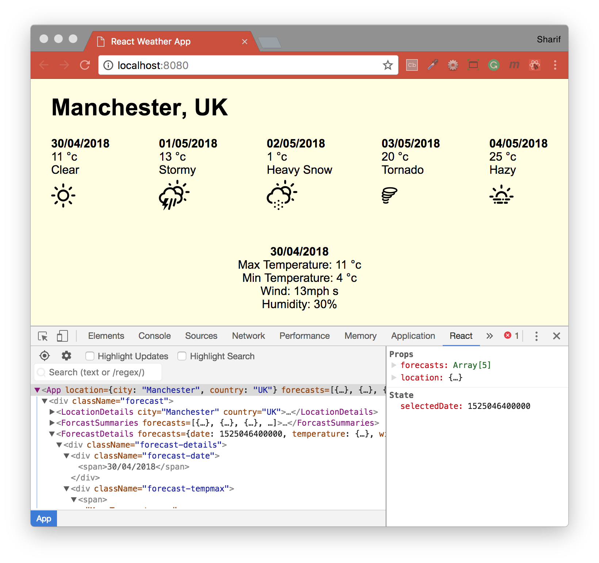
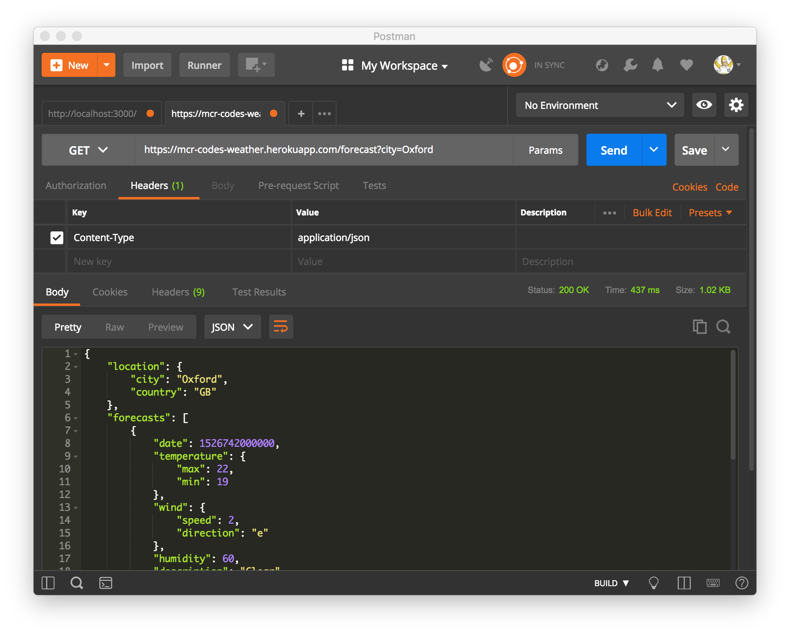

## Weather App - Bootstrap React Project
Making a weather forecasting application, going to be covering React, a popular front-end framework for building user interfaces.


As an MVP, will implement the following features:
* Users should be able to see the name and country of the city the forecast is for.
* Users should be able to see a summary of each day of the forecast, including the date, general description of the weather that day, and maximum temperature.
* Users should be able to click on one of the summaries to view all of the forecasted information for that date

#### Built with
* [npm](https://www.npmjs.com/) - Node Package Manager
* [React](https://www.npmjs.com/package/react) - An npm package to get you immediate access to React
* [React DOM](https://www.npmjs.com/package/react-dom) - This package serves as the entry point of the DOM-related rendering paths
* [Prop Types](https://www.npmjs.com/package/prop-types) - Runtime type checking for React props and similar objects
* [RAF](https://www.npmjs.com/package/raf) - RequestAnimationFrame polyfill for node and the browser
* [Enzyme](https://www.npmjs.com/package/react-test-renderer) - JavaScript Testing utilities for React
* [Webpack](https://www.npmjs.com/package/webpack-dev-server) - Updates the browser on changes
* [Babel](https://babeljs.io/) - Convert JSX syntax and strip out type annotations
* [React Weather icons](https://www.npmjs.com/package/react-icons-weather) - Weather icons meant for use with the OpenWeatherMap, Yahoo and DarkSky API
* [moment](http://momentjs.com/docs/) - A lightweight JavaScript date library for parsing, validating, manipulating, and formatting dates

---
#### Installation
To run this project you will need to download it onto your local machine and install all dependencies.
Navigate inside the folder and install all dependencies by entering the following command on your terminal window:
```
npm install
```
Finally to run the server enter the following command in your terminal window:
```
npm start
```
This will run the server, open [http://localhost:8080](http://localhost:8080) to view it in the browser. If you make any changes and save the changes process will automatically refresh and you will be able to see the results in the browser.

If you want to end the process hold `control` and press `c` in mac, if you are not using mac hold `ctrl` and press `c`.

#### Testing component `location-details` with testing tool Enzyme used in conjunction with Jest:
```bash
> weatherappreact@1.0.0 test /Users/macbook/Documents/GitHub/projectsReact/weatherApp
> jest

 PASS  __tests__/components/location-details.test.jsx
  component location-details
    ✓ renders the passed city and country in a h1 tag (12ms)

Test Suites: 1 passed, 1 total
Tests:       1 passed, 1 total
Snapshots:   0 total
Time:        1.404s
Ran all test suites.
```
#### Testing component `forecast-summaries` with React Chrome development extension:


#### Testing `forecast-summary` both basic and rendered components:
```bash
> weatherappreact@1.0.0 test /Users/macbook/Documents/GitHub/projectsReact/weatherApp
> jest "forecast-summary"

 PASS  __tests__/components/forecast-summary.test.jsx
  component forecast-summary
    ✓ renders the date (11ms)
    ✓ renders the temperature (2ms)
    ✓ renders the description (1ms)
    ✓ renders the icon (1ms)
  forecast-summary rendered components
    ✓ renders correct amount of components (1ms)
    ✓ passes correct values from each forecast (2ms)

Test Suites: 1 passed, 1 total
Tests:       6 passed, 6 total
Snapshots:   0 total
Time:        1.316s
Ran all test suites matching /forecast-summary/i.
```
#### Formatting the icons with [React Weather icons](https://www.npmjs.com/package/react-icons-weather) and date with [Moment.js](http://momentjs.com/docs/):
```js
...
import WeatherIcon from 'react-icons-weather';
import Moment from 'moment';

const ForcastSummary = Props => (
...
    <div className="forecastDate">
      <span>{Moment(Props.date).format('DD/MM/YYYY')}</span>
    </div>
  ...
    <div className="forecastIcon">
      <WeatherIcon name="owm" iconId={Props.icon} />
    </div>
  ...
```
#### Added `forecast-details` stateful component:


#### Making a HTTP request to retrieve some live weather data from the API:

Response Data Structure:
```json
{
  "location": {
    "city": "City name - String",
    "country": "Country name - String",
  },
  "forecasts": [{
    "date": "Forecast date (Unix Timestamp Milliseconds) - Integer",
    "temperature": {
      "max": "Max temperature for day (celcius) - Integer",
      "min": "Min temperature for day (celcius) - Integer"
    },
    "wind": {
      "speed": "Wind speed (mph) - Integer",
      "direction": "Wind direction (e.g. n, sw) - String"
    },
    "humidity": "Humidity - Integer",
    "description": "Overall description of weather - String",
    "icon": "Icon ID - Number"
  }]
}
```