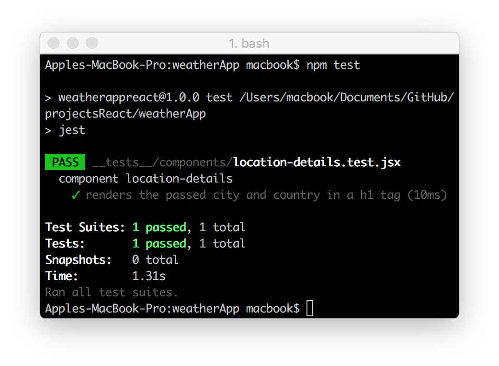

## Weather App - Bootstrap React Project
Making a weather forecasting application, going to be covering React, a popular front-end framework for building user interfaces.

As an MVP, will implement the following features:
* Users should be able to see the name and country of the city the forecast is for.
* Users should be able to see a summary of each day of the forecast, including the date, general description of the weather that day, and maximum temperature.
* Users should be able to click on one of the summaries to view all of the forecasted information for that date

#### Built with
* [npm](https://www.npmjs.com/) - Node Package Manager
* [React](https://www.npmjs.com/package/react) - An npm package to get you immediate access to React
* [React DOM](https://www.npmjs.com/package/react-dom) - This package serves as the entry point of the DOM-related rendering paths
* [Prop Types](https://www.npmjs.com/package/prop-types) - Runtime type checking for React props and similar objects
* [RAF](https://www.npmjs.com/package/raf) - RequestAnimationFrame polyfill for node and the browser
* [Enzyme](https://www.npmjs.com/package/react-test-renderer) - JavaScript Testing utilities for React
* [Webpack](https://www.npmjs.com/package/webpack-dev-server) - Updates the browser on changes
* [Babel](https://babeljs.io/) - Convert JSX syntax and strip out type annotations

#### Testing component `location-details` with testing tool Enzyme used in conjunction with Jest:

